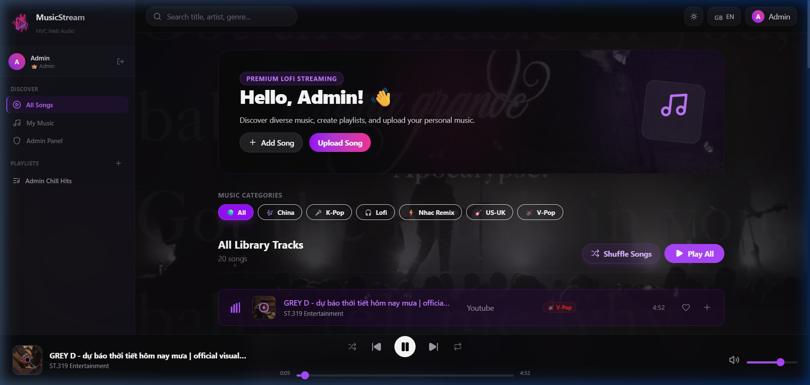

# 🎵 Music Stream - Nền Tảng Phát Nhạc Trực Tuyến Hiện Đại

  

  
  &nbsp;
  
  &nbsp;
  

---

## 📝 Giới Thiệu Chung

**Music Stream** (DubaoMusic) là một nền tảng nghe nhạc trực tuyến cá nhân hóa hiện đại. Dự án được thiết kế với giao diện cao cấp hỗ trợ Dark/Light Mode, tối ưu trải nghiệm người dùng cùng khả năng **tự động phân tích và nhập nhạc thông minh từ YouTube & SoundCloud** chỉ bằng đường dẫn URL. 

---

## 🌟 Tính Năng Nổi Bật Dành Cho Người Dùng

### 📥 1. Tự Động Nhập Nhạc Từ YouTube & SoundCloud qua URL
* **Đơn giản & Nhanh chóng**: Bạn chỉ cần dán liên kết (URL) video YouTube hoặc bài hát SoundCloud vào ô **"Upload Song" / "Thêm nhạc"**.
* **Tự động hóa**: Hệ thống tự động thu thập thông tin tiêu đề, tên nghệ sĩ, ảnh bìa nghệ thuật và thời lượng tệp tin để cập nhật vào thư viện cá nhân của bạn trong vòng vài giây.

### 🎧 2. Trình Phát Nhạc Chất Lượng Cao & Trực Quan
* Trình phát nhạc hỗ trợ đầy đủ tính năng tiêu chuẩn: phát/tạm dừng, tua thời gian, qua bài, phát ngẫu nhiên (Shuffle) và phát lặp lại (Repeat).
* **Hiệu ứng sóng âm động (Sound Wave Animation)**: Biểu đồ cột sóng âm chuyển động nhịp nhàng theo nhịp điệu của bài hát đang phát.

### 🌓 3. Giao Diện Responsive Dark/Light Mode
* Chuyển đổi giao diện Sáng / Tối linh hoạt chỉ với một cú nhấp chuột.
* Sử dụng phong cách thiết kế **Glassmorphism** (kính mờ), hiệu ứng **Neon Glow** tím huyền ảo, và hiệu ứng **Ken Burns** zoom nhẹ hình nền nghệ thuật.
* Tự động lưu và đồng bộ tùy chọn giao diện của bạn thông qua Local Storage.
* Tối ưu hóa giao diện hiển thị trên tất cả thiết bị di động, tablet và máy tính.

### 🌐 4. Hệ Thống Song Ngữ Anh - Việt
* Chuyển đổi ngôn ngữ hiển thị toàn diện giữa **Tiếng Việt (VI)** và **Tiếng Anh (EN)**.
* Tích hợp cơ chế tự động phát hiện ngôn ngữ ưa thích của trình duyệt người dùng.

### 📁 5. Quản Lý Danh Sách & Khám Phá Thể Loại
* Phân loại nhạc thông minh theo các chủ đề: *Lofi, V-Pop, K-Pop, Nhạc Remix, US-UK...*
* Tính năng thả tim yêu thích bài hát để gom nhóm nhanh vào bộ sưu tập cá nhân.

---

## 🛠️ Công Nghệ Phát Triển (Technology Stack)

### 🎨 Frontend (Giao Diện)

  
  
  
  
  
  

### ⚙️ Backend & Database (Hệ Thống & Cơ Sở Dữ Liệu)

  
  
  
  
  

### 🌐 Triển Khai (Deployment)

  
  

